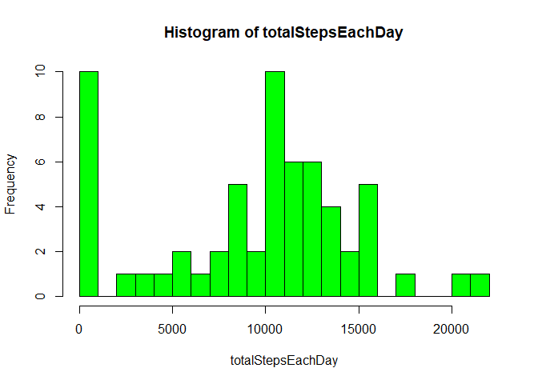
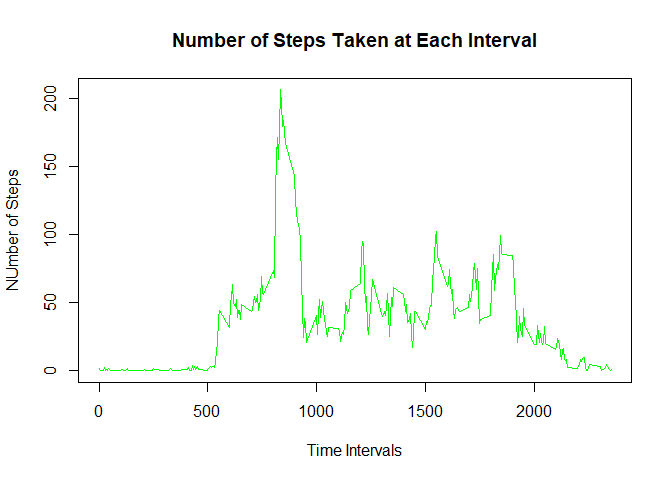
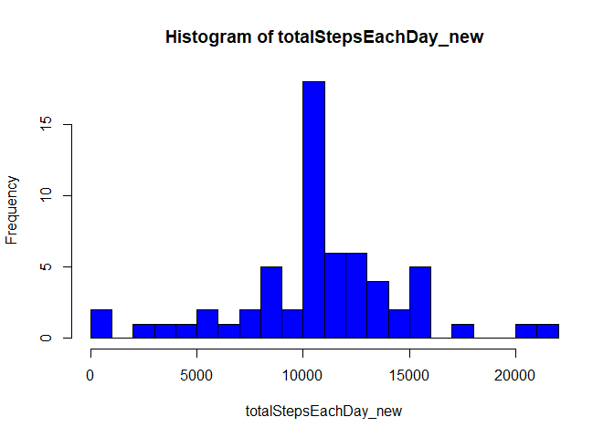
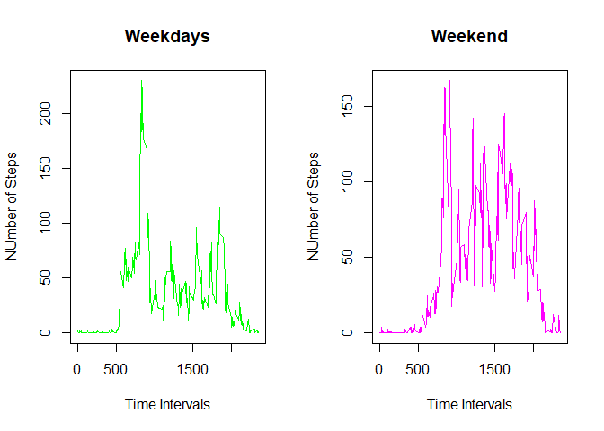

## Loading and preprocessing the data

```r
whole_data <- read.csv( unz( "activity.zip", "activity.csv"), header = TRUE)
whole_data[,2] <- as.Date(whole_data[,2])
```


## What is mean total number of steps taken per day?
### Calculation of the total number of steps taken per day

```r
totalStepsEachDay <- tapply(whole_data$steps, whole_data$date, sum, na.rm = TRUE)
```
### Plotting a histogram of the total number of steps taken each day

```r
hist(totalStepsEachDay, col = "green", breaks = 20)
```

<!-- -->

### Calculate and report the mean and median of the total number of steps taken per day

```r
meanForTheTwoMonths <- (sum(whole_data$steps, na.rm = TRUE) / length(unique(whole_data$date)))
meanForTheTwoMonths
```

```
## [1] 9354.23
```

```r
medianForTheTwoMonths <- median(totalStepsEachDay, na.rm = TRUE)
medianForTheTwoMonths
```

```
## [1] 10395
```

## What is the average daily activity pattern?
### Making a time series plot of the 5-minute interval (x-axis) and the average number of steps taken, averaged across all days (y-axis)

```r
averageStepPerInverval <- tapply(whole_data$steps, whole_data$interval, mean, na.rm = TRUE)
plot(x = unique(whole_data$interval), y = averageStepPerInverval, xlab = "Time Intervals", ylab = "NUmber of Steps", main = "Number of Steps Taken at Each Interval", type = "l", col = "green")
```

<!-- -->

### Finding the 5-minute interval, on average across all the days in the dataset, contains the maximum number of steps:

```r
data = data.frame(x = unique(whole_data$interval), y = averageStepPerInverval)
dplyr::arrange(data, desc(y) )$x[1]
```

```
## [1] 835
```

## Imputing missing values
### Calculating and reporting the total number of rows with NAs:

```r
numberOfRowsWithNAs <- sum(is.na(whole_data$steps))
numberOfRowsWithNAs
```

```
## [1] 2304
```
### The strategy for filling in all of the missing values in the dataset's steps column is to replace those values with the average for those particular 5-minute intervals for the whole period.

```r
whole_data <- cbind(whole_data, averageForThisInterval = rep(averageStepPerInverval, 61))
for (i in seq(from = 1, to = nrow(whole_data))){
    if (is.na(whole_data$steps[i])){
        whole_data$steps[i] <- whole_data$averageForThisInterval[i]
    }
}
```
### Creating a new dataset that is equal to the original dataset but with the missing data filled in.

```r
new_whole_data_without_NAs <- whole_data[,1:3]
```
### Making a histogram of the total number of steps taken each day and Calculating and reporting the mean and median total number of steps taken per day.

#### Calculation of the total number of steps taken per day

```r
totalStepsEachDay_new <- tapply(new_whole_data_without_NAs$steps, new_whole_data_without_NAs$date, sum)
```
#### Plotting a histogram of the total number of steps taken each day

```r
hist(totalStepsEachDay_new, col = "blue", breaks = 20)
```

<!-- -->

#### Calculating and reporting the mean and median of the total number of steps taken per day

```r
meanForTheTwoMonths_new <- (sum(new_whole_data_without_NAs$steps) / length(unique(new_whole_data_without_NAs$date)))
meanForTheTwoMonths_new
```

```
## [1] 10766.19
```

```r
medianForTheTwoMonths_new <- median(totalStepsEachDay_new)
medianForTheTwoMonths_new
```

```
## [1] 10766.19
```
It is evident that the mean and median both have increased as a result of replacing the missing values with the average for those particular time intervals and the maximum value in one day occured 50% more times and minimum of 0 occurred lesser times while the other remained approximately the same. 

## Are there differences in activity patterns between weekdays and weekends?
###Creating a new factor variable in the new dataset with two levels – “weekday” and “weekend” indicating whether a given date is a weekday or weekend day.

```r
Day <- c("x")
new_whole_data_without_NAs <- cbind(new_whole_data_without_NAs, Day = Day)
for (i in seq(from = 1, to = nrow(new_whole_data_without_NAs))){
    if ( weekdays(new_whole_data_without_NAs$date[i]) == "Saturday" |  weekdays(new_whole_data_without_NAs$date[i]) == "Sunday"){
        new_whole_data_without_NAs$Day[i] <- "weekend"
    }
    else {
        new_whole_data_without_NAs$Day[i] <- "weekday"
    }
}
new_whole_data_without_NAs[,4] <- as.factor(new_whole_data_without_NAs[,4])
```
Making a panel plot containing a time series plot of the 5-minute interval (x-axis) and the average number of steps taken, averaged across all weekday days or weekend days (y-axis).

```r
split_list_on_weekday_and_weekend <- split(new_whole_data_without_NAs, new_whole_data_without_NAs$Day)
averageStepPerInverval_weekday <- tapply(split_list_on_weekday_and_weekend[[1]]$steps, split_list_on_weekday_and_weekend[[1]]$interval, mean)
averageStepPerInverval_weekend <- tapply(split_list_on_weekday_and_weekend[[2]]$steps, split_list_on_weekday_and_weekend[[2]]$interval, mean)
par(mfcol = c(1,2))
plot(x = unique(split_list_on_weekday_and_weekend[[1]]$interval), 
     y = averageStepPerInverval_weekday, xlab = "Time Intervals", ylab = "NUmber of Steps", main = "Weekdays", type = "l", col = "green")
plot(x = unique(split_list_on_weekday_and_weekend[[2]]$interval), 
     y = averageStepPerInverval_weekend, xlab = "Time Intervals", ylab = "NUmber of Steps", main = "Weekend", type = "l", col = "magenta")
```

<!-- -->
